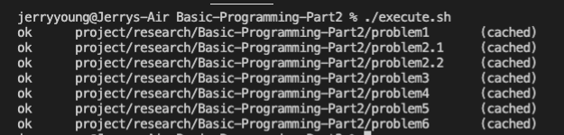

# Tatacara Melakukan Setup Tugas

clone project ini dengan cara

```sh
git clone https://github.com/Immersive-Backend-Resource/Basic-Unit-Test.git
```

setelah clone selesai, jalankan perintah `cd Basic-Unit-Test` -->  **HAL INI DILAKUKAN 1x saja**

Setelah pindah folder, lakukan perintah dibawah ini:

```sh
rm -rf .git
```

setelah menjalankan perintah diatas, lakukan inisialisasi ulang untuk git dengan 

```sh
git init
```

buat repository pada github organization kalian dengan format: `Basic-Unit-Test`

## Tatacara Mengerjakan Tugas

1. Lengkapi function yang sudah disediakan
2. **DILARANG MENGUBAH TIPE DATA HASIL RETURN**
3. Untuk melakukan run program setiap soal lakukan seperti contoh(sesuaikan keperluan): 
    ```golang
    go run ./problem1/problem1.go
    ```
4. Setelah semua program selesai dikerjakan, lengkapi file testing yang sudah disediakan
5. **Tambahkan 5 Test Case untuk setiap problem** 
6. Setelah test selesai dibuat, jalankan proses testing. Lalu screenshot hasil testing seperti berikut

7. Push project ini dan hasil screenshoot ke repo yang telah dibuat pada github organization.
8. Selamat Mengerjakan!!! :grin: